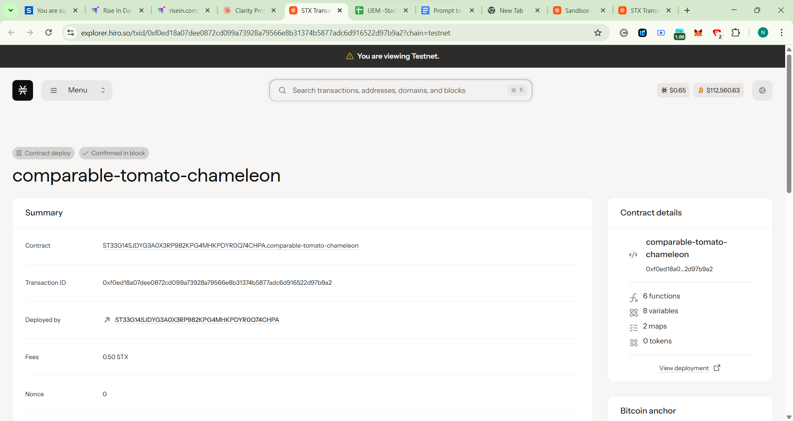

# Proposal Management System

## Project Description

The Proposal Management System is a comprehensive blockchain-based solution built on the Stacks blockchain using Clarity smart contracts. This system enables decentralized communities, DAOs, and organizations to create, manage, and vote on proposals in a transparent, secure, and automated manner. The contract facilitates the complete proposal lifecycle from creation to execution, ensuring democratic decision-making processes with built-in governance mechanisms.

Key features include:
- **Proposal Creation**: Community members can submit detailed proposals with customizable execution thresholds
- **Voting Mechanism**: Transparent voting system with anti-double-voting protection
- **Status Management**: Automatic proposal status updates based on voting outcomes
- **Category Organization**: Proposals can be categorized for better organization and filtering
- **Event Logging**: Comprehensive event emission for indexing and tracking
- **Time-bound Voting**: Configurable voting periods to ensure timely decision-making

## Project Vision

Our vision is to democratize decision-making processes by providing a robust, transparent, and accessible platform for proposal management. We aim to empower communities to govern themselves effectively through:

### Transparency & Trust
- All proposals and votes are recorded immutably on the blockchain
- Public visibility of voting patterns and proposal outcomes
- Verifiable execution of community decisions

### Inclusive Participation
- Low barrier to entry for proposal creation
- Equal voting rights for all community members
- Accessible interface for non-technical users

### Scalable Governance
- Support for organizations of all sizes
- Flexible threshold mechanisms for different types of decisions
- Extensible architecture for future governance innovations

### Automated Execution
- Smart contract-based automatic status updates
- Reduced administrative overhead
- Elimination of human bias in process management

## Future Scope

The Proposal Management System is designed with extensibility in mind. Future enhancements will include:

### Enhanced Voting Mechanisms
- **Weighted Voting**: Implementation of token-based or stake-based voting weights
- **Quadratic Voting**: Advanced voting mechanisms to prevent vote buying and ensure fair representation
- **Delegation Systems**: Allow users to delegate their voting power to trusted representatives
- **Multi-stage Voting**: Support for preliminary votes, amendments, and final voting rounds

### Advanced Proposal Features
- **Proposal Dependencies**: Link related proposals and create execution chains
- **Amendment System**: Allow modification of active proposals based on community feedback
- **Funding Integration**: Built-in treasury management for funding approved proposals
- **Template System**: Pre-defined proposal templates for common governance scenarios

### Governance Analytics
- **Participation Metrics**: Track community engagement and voting patterns
- **Outcome Analysis**: Historical analysis of proposal success rates and implementation
- **Reputation Systems**: Build contributor credibility based on proposal quality and voting history
- **Predictive Analytics**: AI-powered insights for proposal success probability

### Integration Capabilities
- **Multi-chain Support**: Expand to other blockchain networks for broader accessibility
- **Oracle Integration**: Real-world data feeds for proposals requiring external information
- **DeFi Integration**: Connect with liquidity pools, yield farming, and other DeFi protocols
- **Identity Verification**: Sybil-resistant identity solutions for one-person-one-vote scenarios

### User Experience Enhancements
- **Mobile Applications**: Native mobile apps for iOS and Android platforms
- **Notification Systems**: Real-time alerts for proposal updates and voting deadlines
- **Discussion Forums**: Integrated discussion platforms for proposal deliberation
- **Multilingual Support**: Localization for global community participation

### Enterprise Features
- **Role-based Permissions**: Hierarchical governance structures for complex organizations
- **Compliance Tools**: Built-in compliance checking for regulatory requirements
- **Integration APIs**: RESTful APIs for integration with existing organizational tools
- **White-label Solutions**: Customizable branding for enterprise deployments

## Contract Address Details

*[Contract address will be added after deployment]*

**Mainnet:** `[To be updated after mainnet deployment]`

**Testnet:** `[To be updated after testnet deployment]`

### Deployment Information
- **Network**: Stacks Blockchain
- **Language**: Clarity
- **Deployment Date**: [To be updated]
- **Version**: 1.0.0
- **Gas Optimization**: Optimized for minimal transaction costs

### Contract Verification

---

*For technical support, feature requests, or community discussions, please visit our GitHub repository or join our community channels.*
##
contract address details

